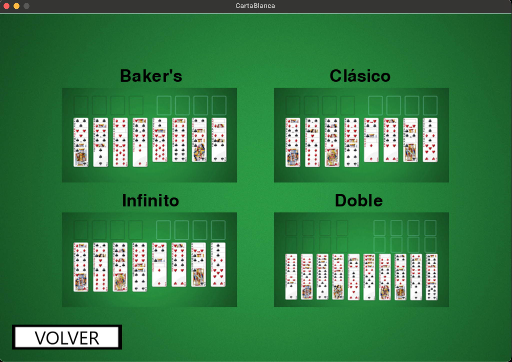
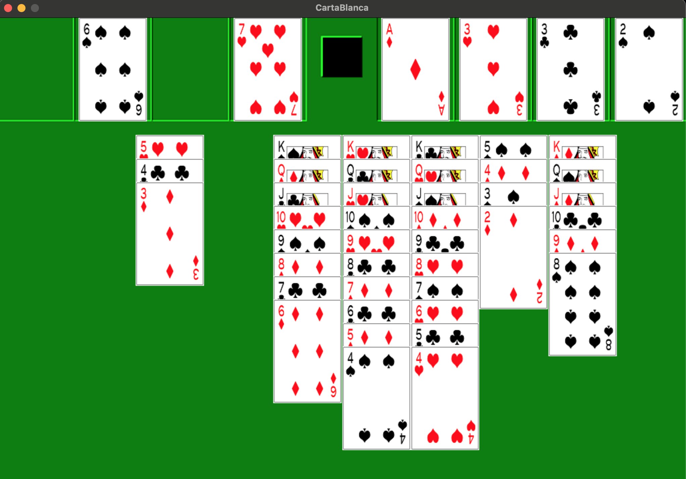
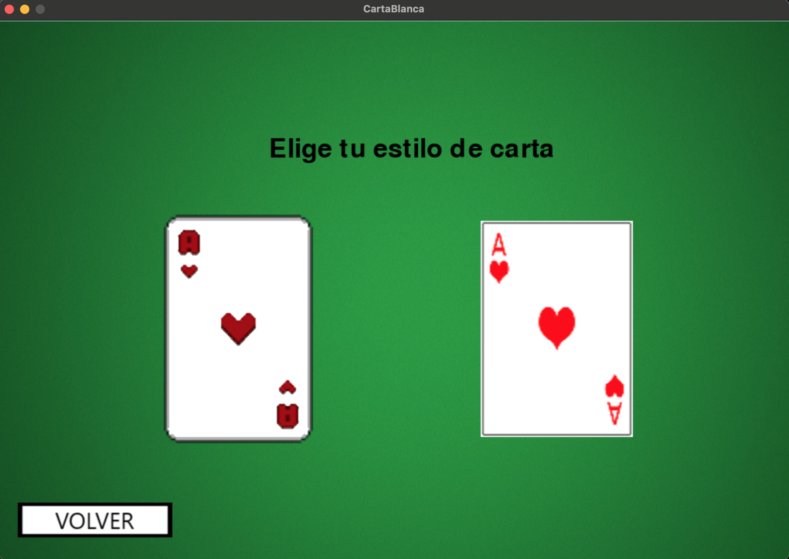

# Freecell Plus

Freecell Plus is a feature-rich Freecell card game with additional game modes, developed using Python and Pygame. Enjoy the classic Freecell experience along with new, exciting challenges.

## Features

- **Classic Freecell**: The traditional Freecell card game.
- **Additional Game Modes**:
  - **Infinite**: No limit on card stacking.
  - **Baker's**: Sequences are built by suit instead of by alternate color.
  - **Double**: Play with two decks of cards.

 

 

- **Personalation**:
  - Change the style of the cards.
  
 

## Installation

To run Freecell Plus, you need Python and Pygame installed on your system.

1. **Clone the repository**:
   ```sh
   git clone https://github.com/yourusername/freecell-plus.git
   cd freecell-plus
   ```
   
2. **Install Pygame**:
   - First, ensure you have Python installed. You can download it from [python.org](https://www.python.org/downloads/) if not.
   - Install Pygame using pip:
     ```sh
     pip install pygame
     ```
   
3. **Run the game**:
   ```sh
   python main.py
   ```
